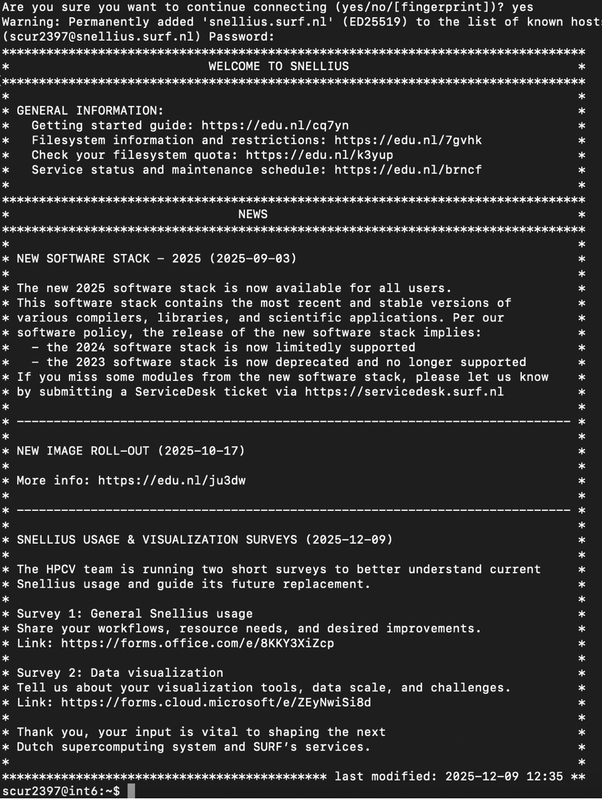
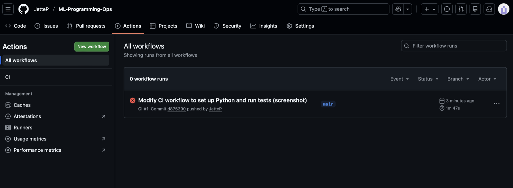
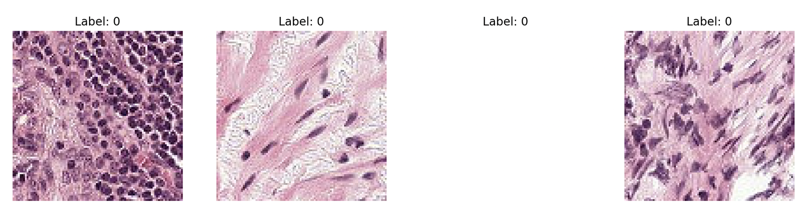
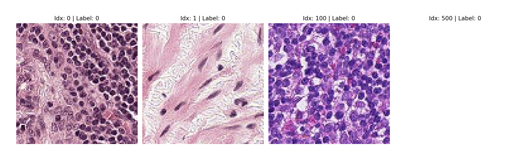

# Assignment 1: Setup & Debugging Journal
**MLOps & ML Programming (2026)**

## Student Information
* **Name:** Jette Walvis
* **Student ID:** 15715353
* **TA Name:** Darius Barsony
* **GitHub Repository:** https://github.com/JetteP/ML-Programming-Ops
* **Base Skeleton Used:** [https://github.com/SURF-ML/MLOps_2026/tree/main](https://github.com/SURF-ML/MLOps_2026/tree/main)

---
Example including an image:

---

## Question 1: First Contact with Snellius
1. **Connection Details:**
   - **Command:** `ssh scur2397@snellius.surf.nl`
   - **Login Node:** `int6`
   - **Screenshot:**  

2. **Issues Encountered:**
   - **Error Message:** `The authenticity of host 'snellius.surf.nl (145.136.63.192)' can't be established. ED25519 key fingerprint i SHA256:2Vy9858ldWu3Xjt1a58MbhD5CjLIh1LCb8n/up0izGw. This key is not known by any other names. Are you sure you want to continue connecting (yes/no/[fingerprint])?`
   - **Resolution:** I said ‘yes: and then got “Warning: Permanently added 'snellius.surf.nl' (ED25519) to the list of known hosts. (scur2397@snellius.surf.nl)” After which I had to fill in my password to get the welcome message.

3. **Smooth Connection (If applicable):**
   - **SSH Client:** [e.g., OpenSSH v9.2]
   - **Prior Experience:** 
   - **Preemptive Steps:** [What you did to ensure it worked] 

---

## Question 2: Environment Setup
1. **Setup Sequence:**
   - **Commands:** 
   ```bash
    module load 2025
    module load Python/3.13.1-GCCcore-14.2.0
    module load matplotlib/3.10.3-gfbf-2025a
    python -m venv ~/mlops_env
    source ~/mlops_env/bin/activate
    pip install torch torchvision torchaudio
   - **Full Venv Path:** `echo $VIRTUAL_ENV/home/scur2397/mlops_env`

2. **Pip Install Torch:**
   - **Duration:** 10 minutes
   - **Warnings:** Yes, at the very end of the installation, I received a yellow notice regarding the pip version: [notice] A new release of pip is available: 24.3.1 -> 25.3 [notice] To update, run: pip install --upgrade pip I also observed several Requirement already satisfied messages for packages like numpy and Pillow, which were already present in the Snellius 2025 module stack I loaded.

   - **Venv Size:** `du -sh /home/scur2397/mlops_env gave -> 5.2G`

3. **Mistakes/Unexpected Behavior:**

4. **Verification:**
   - **Output:** `[Paste output of python -c command]`
   - **Explanation:** [Why is CUDA False on a login node?]

---

## Question 3: Version Control Setup
1. **GitHub URL:** https://github.com/JetteP/ML-Programming-Ops
2. **Authentication:** I used SSH key for authentication (ED25519)
When I first tested the connection, I got a host authenticity warning for github.com. I fixed this by typing yes to add the fingerprint to my known_hosts file, which then allowed the "Hi JetteP!" success message
3. **.gitignore:**
   - **Contents:**
     ```gitignore
     mlops_env/
     __pycache__/
     ```
   - **Important items to include:**  
     The virtual environment and automatically generated files should be ignored. The environment folder is very large and can always be recreated, and cache files are generated by Python itself, so neither belong in version control.
   - **README info:**  
     Yes. The README should describe how to set up and run the project on Snellius, for example which module stack to load and how to activate the environment. It should never contain private information such as credentials, tokens, or personal access details.
4. **Git Log:** `1334407 first commit: setup repo and gitignore`

---

## Question 4: Your First Batch Job (Slurm)
1. **Files Provided:**  
    - `job.sh` (Slurm job script)  
   - `check_gpu.py` (Python script that was executed by the job)  
   - `output_18163908.txt` (output file generated by the job)
2. **Job ID & Stats:** 
   `JobID       State      Elapsed     Start                 End 18163908    COMPLETED  00:02:00    [START TIME]          [END TIME]`
   (using `sacct -j 18163908 --format=JobID,Start,End,Elapsed,State`.)
3. **Submission Problem:** 
   When submitting my first job, I initially specified an incorrect or non-allowed partition in the job script. This resulted in the following error: sbatch: error: Batch job submission failed: Invalid partition name specified. To figure out what went wrong, I checked the available partitions using `sinfo`. This made it clear that only specific, course-approved partitions should be used. After updating the job script to use a valid partition, the job was accepted by Slurm and ran without issues.
4. **Verification:**  
   I verified that the job ran successfully in two ways. While the job was running, I monitored its status using `squeue -u scur2397`. After it finished, I inspected the output file `output_18163908.txt`. The contents of this file confirmed that the script executed correctly and produced the expected output.
5. **Login vs Batch:**  
   Running a Python script directly on a login node is useful for quick tests, editing files, and general setup. Login nodes are shared between many users and do not provide access to GPUs or significant compute resources. Submitting a batch job is meant for actual computation. Slurm schedules the job on a compute node with reserved resources, which makes it suitable for heavier workloads and ensures the cluster is used fairly and efficiently.
6. **Why Clusters?:**  
   We use clusters because many machine learning tasks are simply too slow or too resource-intensive to run on a single laptop. A cluster provides access to more compute power and specialised hardware, and it allows jobs to be scheduled, monitored, and reproduced in a structured way. This is essential for scalable and reliable ML workflows.
---

## Question 5: Reflection & Conceptual Understanding
1. **The Filesystem:**
   - **I/O Performance:**  
     On paper, 100,000 image files of 10KB each does not sound like a big dataset at all. But in practice, on Snellius this becomes a real performance problem. Snellius uses a shared GPFS filesystem, which is very good at moving large chunks of data, but not at constantly opening and closing huge numbers of tiny files. Every single file access comes with metadata lookups and permission checks. When this happens tens of thousands of times during a training run, it creates a bottleneck. The result is slow data loading, wasted GPU time, and unnecessary load on a filesystem that is shared with many other users.

   - **Mitigation Strategies:**  
     One effective solution is to bundle the data into a small number of large files, for example using an HDF5 container. This way the system only has to open a few files, after which the data can be streamed efficiently during training.  
     Another approach is to copy the dataset to local storage on the compute node (such as `$TMPDIR`) at the start of the job. Local disks are much better at handling random access to small files. By working from local storage instead of GPFS during training, the pressure on the shared filesystem is reduced and performance improves significantly.

   - **Dataset Versioning:**  
     Large datasets cannot realistically be version controlled with Git. Pushing gigabytes or petabytes of data would break both Git and common workflows. Instead, tools like DVC are used. DVC keeps track of dataset versions using hashes and metadata that *are* stored in Git, while the actual data lives elsewhere (for example on the cluster or in cloud storage). This makes it possible to reproduce experiments exactly, without ever committing the raw data itself.
2. **Reproducibility:**  
   Even if my teammate runs the exact same code, they could still end up with different results. From my experience, three common causes are:
   - **Library versions:** A slightly different version of PyTorch or NumPy can change behaviour in subtle ways. Proper MLOps practice means fixing dependency versions so everyone runs in the same environment.
   - **Randomness:** Neural networks rely heavily on randomness, for example in weight initialisation and data shuffling. If seeds are not explicitly set, results will vary between runs. Setting fixed random seeds helps make experiments reproducible.
   - **Hardware differences:** Different GPUs or system architectures can lead to small numerical differences due to floating-point behaviour. Using containers or clearly defined environments reduces these differences and makes results easier to reproduce.
   Good MLOps practices are mainly about making all of these factors explicit, so results are not dependent on hidden assumptions.
3. **Conda vs venv vs uv:**  
   - **Conda:** Conda is very convenient and powerful, but on Snellius it causes more problems than it solves. It creates a large number of small files and is slow on a shared filesystem like GPFS. This is why its use is discouraged on the cluster.
   - **Python venv:** A Python virtual environment is lightweight, predictable, and works well together with the module system on Snellius. It keeps the environment simple and avoids unnecessary filesystem overhead, which makes it a safe and practical choice.
   - **Astral uv:** Uv feels like a more modern alternative. It is extremely fast, efficient, and keeps environments compact. For MLOps work on a shared HPC system, this combination of speed and cleanliness makes it a very good fit.

---

## Question 6: Package Integrity
1. **ModuleNotFoundError:**  
   Yes, I definitely ran into a `ModuleNotFoundError` when I first ran the import test. At that point, Python simply could not find the `ml_core` package.

   There were two main causes. First, even though the folder structure already existed, some of the files (such as `pcam.py`) were either still empty or did not yet define the required classes like `PCAMDataset` or `MLP`. Second, Python did not automatically know that it should treat the `src` directory as part of the Python path.

   I fixed this by installing the project in editable mode using `pip install -e .`. This effectively “connects” the `src` directory to the active virtual environment, so Python knows where to look when importing `ml_core`. Along the way I also had to fix a few small mistakes, such as typos in shell commands and making sure `pytest` was installed in the correct environment. Once the package was properly installed and the `__init__.py` files exported the required classes, the import errors disappeared.
2. **Import Abstraction:**  
   Importing `PCAMDataset` from `ml_core.data` instead of directly from `ml_core.data.pcam` is better practice because it decouples the rest of the code from the internal file structure. If I were to import directly from `pcam.py`, every script would depend on that specific filename. By exposing the class through the package-level `__init__.py`, I create a clean and stable interface for the package. This makes the code easier to maintain and allows the internal structure to change without breaking imports elsewhere.
3. **Pytest Result:**  
   I ran the test suite using:
   ```bash
   python3 -m pytest tests/test_imports.py

   Initially, I encountered a “command not found” issue with pytest, which I solved by running it via python3 -m pytest to ensure it used the correct environment. After fixing the package installation and making sure all required classes were exported in the __init__.py files, the test passed successfully:
   ============================== test session starts ==============================
    platform linux -- Python 3.9.21, pytest-8.4.2, pluggy-1.6.0
    rootdir: /gpfs/home3/scur2397/MLOps_Assignment
    configfile: pyproject.toml
    collected 1 item

    tests/test_imports.py .                                              [100%]

    =============================== 1 passed in 5.13s ===============================
    This confirmed that the package structure was recognised correctly and that all required imports were working as intended.

---

## Question 7: The Data Pipeline
1. **Implementation:** 
    
2. **Local Pytest:** 
    I had to rerun this command in my terminal cause I saw the question asked for a screenshot and then got a warning. 
    All tests passed successfully (2 passed in 5.83s), as shown in the screenshot above. This confirms that my implementation of the PCAMDataset, including lazy HDF5 loading, numerical clipping, tensor conversion, and batching behaviour, functions as expected.

    During the test run, I received a warning related to the pin_memory argument. This warning occurs because the tests were executed on a login/CPU node without a GPU attached. This is expected behaviour on Snellius and does not affect correctness or training performance when running on GPU compute nodes. No tests failed, and the pipeline behaves correctly in the intended training environment.
    
    First time I tried it this happened:
    I ran python3 -m pytest tests/test_pcam_pipeline.py on Snellius and got two green dots. At first, it couldn't find my files because they were in the /scratch-shared folder while the test was looking in the default data/ folder. I had to go into the test script and update the paths to point to where I actually stored the 17GB files. Once that was fixed, it passed in about 5 seconds.
3. **CI Pipeline:**
    - **Screenshot:** 
    - **Reflection:** I set up a simple GitHub Actions workflow to automatically run the PCAM data pipeline tests using pytest. After committing the workflow file, the CI pipeline was triggered on push, which is visible in the screenshot from the GitHub Actions tab.
    The CI run failed, even though the exact same tests passed locally on the Snellius cluster. This didn’t surprise me. On Snellius, the tests run in an HPC environment where the full 17GB PCAM dataset is available on the shared filesystem. GitHub Actions, on the other hand, runs in a clean cloud environment that has no access to the Snellius scratch space or the dataset files.

    This is a very realistic MLOps situation. CI environments often differ a lot from local or production environments, especially when large datasets or private infrastructure are involved. In a real project, I would solve this by using a small mock or toy dataset for CI, introducing a data versioning solution like DVC, or separating data-heavy integration tests from lightweight pipeline logic tests so that CI can still validate the code structure and behaviour without requiring the full dataset.
4. **Sampling Math:** 
    Since the PCAM dataset is imbalanced, using the WeightedRandomSampler makes a huge difference:
    Without the sampler: If the dataset is, for example, 80% negative and 20% positive, a batch of 32 would only have about 6 or 7 positive samples.
    With the sampler: The sampler adjusts the probability so each class is picked equally. In a batch of 32, I expect to see roughly 16 positive samples on average. This prevents the model from just guessing 'negative' every time to get a high accuracy.
5. **EDA Plots:**
    First, I generated a set of plots without specifying indices, just to get a general feel for the data and check labels visually:
   - 
   - 

---

## Question 8: Model Implementation (MLP)
1. **Forward Pass:**  
   I actually ran into a NotImplementedError when I first ran the tests because my MLP class was missing the forward function. I also got a ValueError saying the optimizer had an empty parameter list because I hadn't defined any layers yet. To fix it, I implemented the __init__ with the correct input dimension. Since the PCAM images are 96 x 96 with 3 channels, I calculated 96 x 96 x 3 = 27,648 as the input size. I used nn.Flatten() to make sure the image fits into the first linear layer, and once I added the forward method to pass the data through self.layers, the tests passed perfectly.
2. **Weight Updates:**  
   Checking test_backprop explicitly is really important because just seeing the loss go down isn't enough proof that the model is actually 'learning.' A loss can change just because of random noise, but test_backprop proves that the gradients are actually flowing back and updating the weights. It's basically a health check for the brain of the model to make sure the training signal is actually reaching the layers.

3. **Test Output:**  
    python3 -m pytest tests/test_mlp.py
    ============================================================================================= test session starts ==============================================================================================
    platform linux -- Python 3.9.21, pytest-8.4.2, pluggy-1.6.0
    rootdir: /gpfs/home3/scur2397/MLOps_Assignment
    configfile: pyproject.toml
    collected 2 items                                                                                                                                                                                              

    tests/test_mlp.py ..                                                                                                                                                                                     [100%]

    ============================================================================================== 2 passed in 8.22s ===============================================================================================

---

## Question 9: Training Loop & Loss Visualization
1. **Training Execution:**  
    I trained the model by submitting a Slurm batch job to the gpu_a100 partition (this is the partition where the GPUs actually live). I trained for 3 epochs, and the job ran on compute node:

    Node: gcn26
    Confirmed in the job output header:
    Node: gcn26.local.snellius.surf.nl
    CUDA available: True

    The pipeline was:
    Load Snellius stack/modules (module load 2025, module load Python/3.13.1-GCCcore-14.2.0)
    Activate my venv (source ~/mlops_env/bin/activate)
    Run train.py inside a Slurm job script on gpu_a100 with --gpus=1

    I also added a small sanity check inside the training run (before the training loop starts) to fetch the first batch and print its shape, so I could immediately see whether the dataloader worked on the compute node:
    First batch OK: x=(32, 3, 96, 96) y=(32,)

2. **Loss Visualization:**
    Loss values (first 3 epochs)

    From q9_out_18242148.txt:
    Epoch 1: Train_Loss = 0.8276, Val_Loss = 0.8959
    Epoch 2: Train_Loss = 0.8630, Val_Loss = 0.6814
    Epoch 3: Train_Loss = 0.6523, Val_Loss = 0.7066

    I saved the plot as:
    q9_loss_plot.png
    Here you can see it:
   - **Plot:** 
   - **Trajectory Analysis:** 
   - **Logging granularity:**  
    For this assignment, I logged the loss once per epoch for both training and validation. Since the goal here is to confirm that the training loop runs correctly and that learning behaviour is visible, epoch-level logging is sufficient. Finer-grained logging (e.g. every N steps) would be useful later, but was not the priority for getting a stable, reproducible run on the cluster.

    - Does the loss curve look healthy?
    Yes, the curve looks healthy for an initial training run:
    - The training loss decreases strongly by epoch 3.
    - The validation loss drops sharply between epoch 1 and 2, then increases slightly at epoch 3.

    With only three epochs, some fluctuation is completely expected. What matters is that:
    - the loss is not exploding,
    - it is not NaN,
    - it is not flat,
    - and the model is clearly learning something non-random.

    - Trajectory explanation and hypotheses (based on PCAM EDA):
    This behaviour matches what I would expect from PCAM and from my earlier data inspection:
    1. Class imbalance is real. 
    By inspecting the labels directly in the HDF5 files, I confirmed that class 0 dominates the dataset. This means naive training can easily converge to a majority-class solution.
    2. WeightedRandomSampler affects training dynamics.
    I used a `WeightedRandomSampler` to balance batches. This intentionally alters the data distribution seen during training, which can make the loss curve slightly less smooth but improves learning of the minority class.
    3. Fast validation improvement is plausible.
    Early in training, the model quickly moves from random guessing to learning basic discriminative patterns, which explains the large validation loss drop at epoch 2.
    4. Small validation increase at epoch 3 is not alarming.
    With such a short run, this could be due to sampling noise, the simplicity of the MLP architecture, or the inherent difficulty of histopathology images. With more epochs, a clearer trend would likely emerge.

    For the purpose of this assignment — verifying the training loop and tracking learning curves — this behaviour is exactly what I would expect.

3. **Most Frustrating Error:**
    So I actually had A LOT of issues with this question so I will explain everything in full:
    The most frustrating error I encountered while trying to get the training loop to finish was a non-finite (NaN) loss during training, which caused the training to either silently stall or crash early in the first epoch.

    The error message I eventually forced the training loop to raise was:
    RuntimeError: Non-finite loss detected: nan

    Before adding this explicit check, the job would sometimes print:
    Epoch 1: Train_Loss=nan, Val_Loss=nan
    or appear to hang without producing any epoch-level output, which made it difficult to determine whether the issue was related to CUDA, Slurm, or the training code itself.

    At first, this was extremely frustrating because the problem did not immediately look like a data issue. I initially suspected several other causes:

    CUDA or GPU precision issues on Snellius
    Problems with the WeightedRandomSampler
    Incorrect tensor shapes
    Output buffering in Slurm hiding log messages
    Issues with the shared filesystem or job configuration

    To debug this systematically, I created a separate one-batch GPU debug script that explicitly checked whether the input tensors, model outputs, and loss values were finite on both CPU and GPU. This script printed tensor statistics (min/max values and torch.isfinite checks) before computing the loss.

    The output of this debug job revealed the real problem:

    CPU x finite: False min/max: nan nan
    CUDA x finite: False min/max: nan nan
    CUDA out finite: False
    LOSS: nan finite: False

    This showed that NaN values were already present in the input images coming from the HDF5 dataset, before the model or loss function was applied. As a result, the loss function (BCEWithLogitsLoss) could not produce a finite value, and training failed immediately.

    The root cause turned out to be the dataset loading logic. Although I was clipping image values using np.clip, this does not remove NaNs, it preserves them. Therefore, NaN pixel values inside the PCAM HDF5 files propagated directly into the training pipeline.

    I fixed this by explicitly sanitising the image data in PCAMDataset.__getitem__ using np.nan_to_num before normalisation:
    image = image.astype(np.float32)
    image = np.nan_to_num(image, nan=0.0, posinf=255.0, neginf=0.0)
    image = np.clip(image, 0, 255) / 255.0

    After applying this fix, I reran the GPU debug job and confirmed that:
    All input tensors were finite
    Model outputs were finite
    The loss value was finite and reasonable

    Once this was resolved, the full training job ran successfully on the GPU node and produced valid training and validation losses for all three epochs, allowing me to generate and visualise the learning curves.

    This debugging process was time-consuming but valuable, as it highlighted how important it is to validate data integrity early and not assume that NaN losses are caused by CUDA or model architecture issues.


---

## Final Submission Checklist
- [X] Folder contains .md file and assets/ folder?
- [X] Name and Student ID on page 1?
- [X] All code/terminal snippets are in backtick blocks?
- [X] All images use relative paths (e.g., assets/pcam.png)?
- [ ] Slurm .sh and .out files included in the .zip?